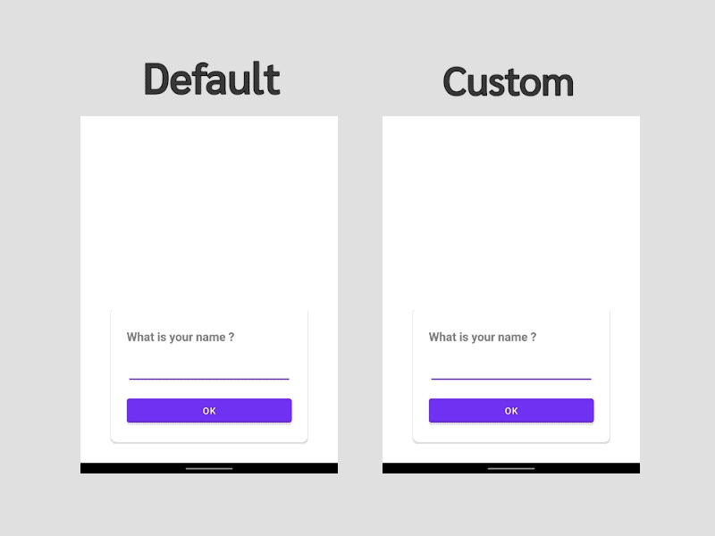

 

# Group Focusable
Prevent the view behind on-screen keyboard when edit text is focused in Android UI

## Download
**Gradle**
```
implementation 'com.akexorcist:group-focusable:1.0.2'
```

## Usage
There\'re 2 views in this library
* `GroupFocusableLayout`
* `GroupFocusableEditText`

Design your UI in`GroupFocusableLayout` as you want and use `GroupFocusableEditText` instead of `EditText` or `AppCompatEditText`
then all views inside `GroupFocusableLayout` will not behind the on-screen keyboard when user tap at `GroupFocusableEditText` for typing

For example
```xml
<com.akexorcist.groupfocusable.GroupFocusableLayout>
    
    <LinearLayout>
        
        <TextView />
        
        <com.akexorcist.groupfocusable.GroupFocusableEditText />
        
        <Button />
        
    </LinearLayout>
    
</com.akexorcist.groupfocusable.GroupFocusableLayout>
```



## Licence
Copyright 2021 Akexorcist

Licensed under the Apache License, Version 2.0 (the "License"); you may not use this work except in compliance with the License. You may obtain a copy of the License in the LICENSE file, or at:

http://www.apache.org/licenses/LICENSE-2.0

Unless required by applicable law or agreed to in writing, software distributed under the License is distributed on an "AS IS" BASIS, WITHOUT WARRANTIES OR CONDITIONS OF ANY KIND, either express or implied. See the License for the specific language governing permissions and limitations under the License.
